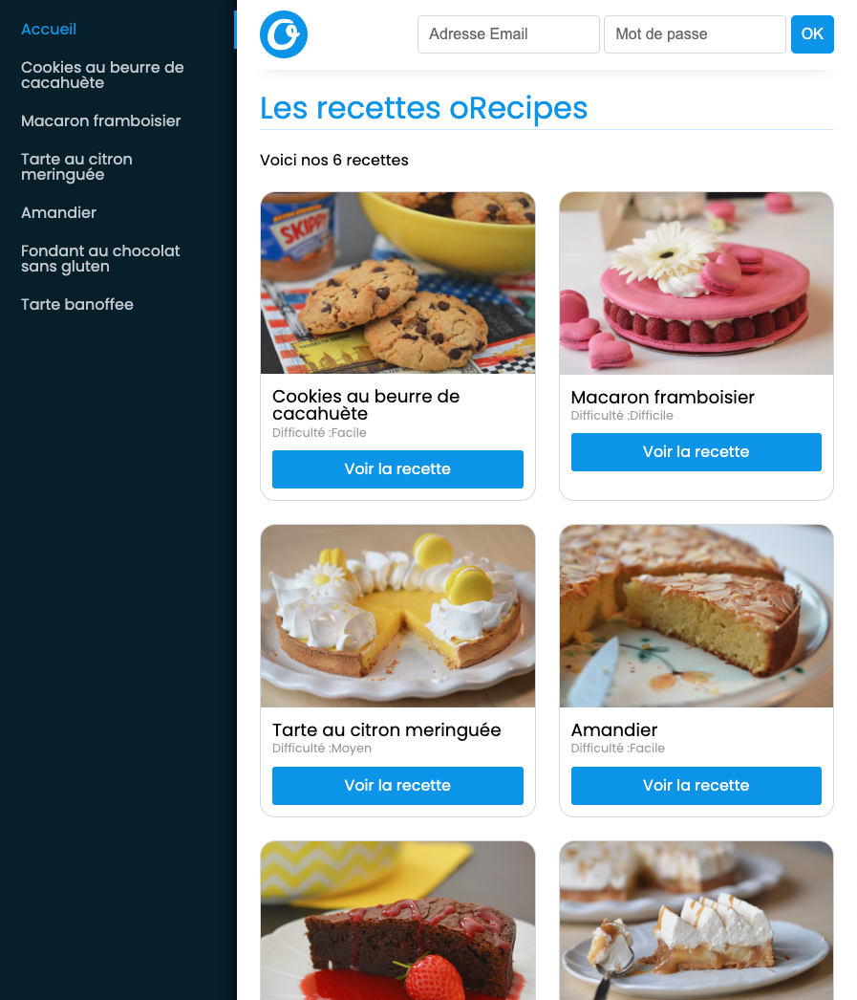
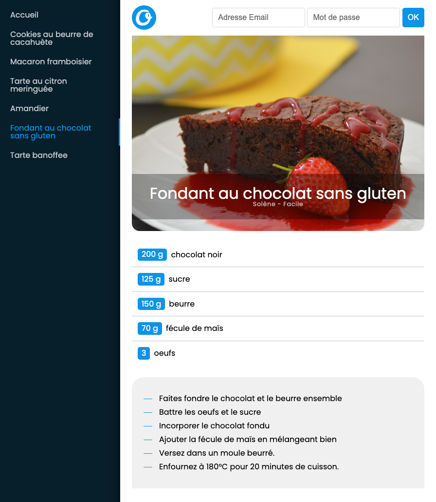

# Challenge atelier O'Recipes

**Objectif de la journée** : Réaliser une interface front en React qui affiche des recettes. 💪

## 1. Création du projet

- Dans ce repo, créez un nouveau projet React TS avec [Vite](https://vite.dev/guide/#scaffolding-your-first-vite-project) via la commande `npm create vite@latest frontend -- --template react-ts --no-interactive`.
- [Installez Biome](./fiches_recap_cours/01-biome.md) à la place de eslint.

## 2. Structure statique de composants

**Objectif** : Créez la structure de la page d'accueil en découpant avec les composants qui vous semblent pertinents.

Vous pouvez vous inspirer de la maquette suivante :

Pour commencer, vous pouvez afficher juste 1 ou 2 cartes recettes avec des données en dur. Vous allez dynamiser ensuite avec les données de l'API.

### Style 🎨

Pour le style, vous pouvez utiliser CSS, [SASS](https://sass-lang.com/), [Tailwind CSS](https://tailwindcss.com/) ou une bibliothèque de composants pré-stylés comme [MUI (Material-UI)](https://mui.com/), [Chakra UI](https://chakra-ui.com/) ou [Ant Design](https://ant.design/).

Dans tous les cas le style n'est pas imposé, **n'y passez pas plus de 2h** mais faites en sorte d'avoir un site avec une présentation sympa qui vous plait.

Vous pouvez récupérer le logo dans le dossier `front_docs/` de ce repo.

## 3. Recettes de l'API

**Objectif** : afficher les recettes de l'API.

Le code est l'API est dispo dans ce repo, par curiosité vous pouvez regarder le code dans le dossier `back_api/`.

Lancez l'API en local :

- la première fois, dans le dossier `back_api/` lancez la commande `npm install` pour installer les dépendances
- puis lancez l'API avec la commande `npm start`

L'API est documentée avec un Swagger sur l'url `/api/docs/` qui vous permet de tester les requêtes directement dans le navigateur.

Côté front :

- Mettez en place un [state](./fiches_recap_cours/04-state.md) qui permet d'accueillir la liste des recettes.
- N'oubliez pas de [typer ce state](./fiches_recap_cours/06-typer-useState.md) pour qu'il puisse accueillir un tableau d'objet recette meme si vous l'initialisez avec un tableau vide.
- Après le premier rendu de votre app, fetchez les données et enregistrez les dans le state.
- Utilisez les données du state pour créer les cartes recettes et les liens recettes du menu. A chaque fois, vous [devrez utiliser map sur le tableau du state pour créer un tableau d'elements dans votre JSX](./fiches_recap_cours/03-rendu-listes.md).

### BONUS

- Mettez en place un loader qui sera affiché tant que les recettes ne sont pas encore dans le state.

## 4. Router et page recette

**Objectif** : au click sur un lien recette, afficher une page avec les détails de la recette (ingrédients et instructions)

Pour la page recette vous pouvez vous inspirer de la maquette suivante :

Il vous faudra créer un routeur à l'aide de [react-router](https://reactrouter.com/en/main). Servez-vous de la [fiche récap sur react-router](./fiches_recap_cours/09-react-router.md) et sur ce qui a été vu la veille pour vous guider !

- Installez react-router
- Mettez en place le BrowserRouter
- Replacez tous les liens par des Link ou NavLink
- Créez vos routes :
  - page d'accueil avec toutes les cartes recettes
  - page recette avec les détails de la recette dont le slug sera dans l'URL (il faudra créer une route dynamique, elle doit matcher quelque soit le slug)
- Créez le composant pour cette page recette, dans ce composant pour récupérer le slug de l'URL vous devrez utiliser la fonction useParams de react-router.

### 4.BONUS

- Vous remarquez que si on scrolle un peu puis on change de page, on reste scrollé ! Normal, on n'a pas réellement changé de page ... donc faites en sorte qu'à chaque changement de page le scroll revienne à zéro. (utilisez la fonction scrollTo sur l'objet window)
- indice : le scroll de la fenêtre de navigateur est un effet de bord donc utilisez [useEffect](./fiches_recap_cours/06-useEffect.md) ;)

## 5. Login Form

Objectif : à la validation du formulaire de login, envoyez une requête au back pour vérifier les credentials et afficher un message en fonction de la réponse : "Bienvenue Pseudo" ou "Erreur de connexion".

- Au submit du formulaire envoyez une requête POST vers le end point `/api/login/` avec les identifiants saisis par l'utilisateur. A vous de choisir [comment récupérer les saisies utilisateur](./fiches_recap_cours/05-formulaires.md).
- En fonction de la réponse, enregistrez un message dans le state.
- Utilisez ce message pour l'afficher sur la page.

### 5.BONUS

Après le premier rendu du formulaire, récupérez l'élément du DOM input email et placez le focus dedans. Vous devrez utiliser une ref pour récupérer le node input _(getElementById ou querySelector interdit !! ;) )_

Si vous n'avez pas vu useRef en cours, vous pouvez consulter la [fiche récap sur useRef](./fiches_recap_cours/14-useRef.md).

### Si vous avez tout fini : Bravo 🔥

-> venez me demander des idées de bonus supplémentaires 😉
